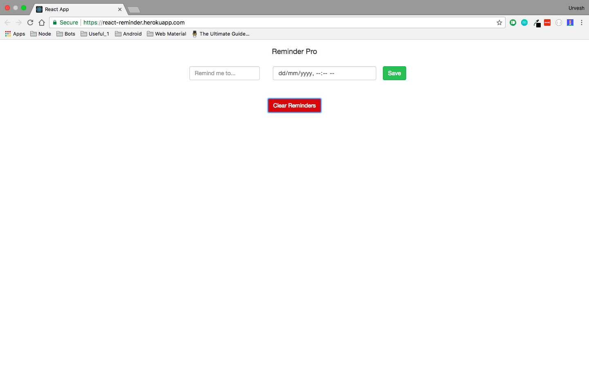
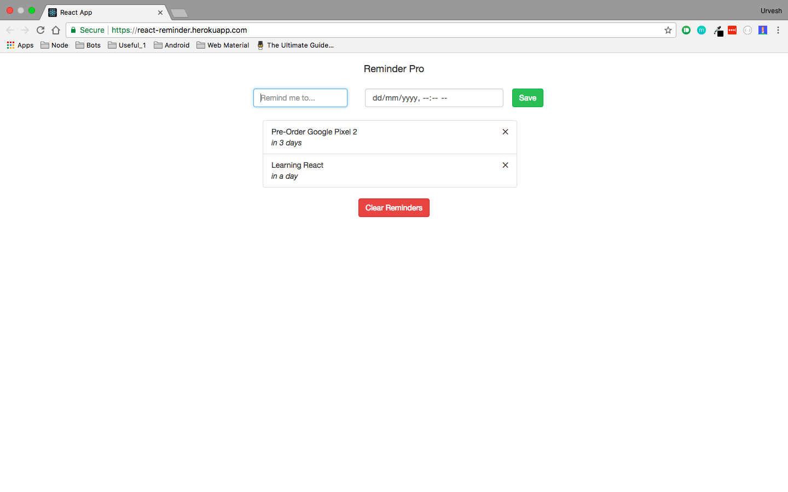

# react-reminder-pro
This is basics of react.js and redux

Basically it a reminder app which stores reminder locally on client side using cookies

Try it out:
[Reminder Pro](https://react-reminder.herokuapp.com/)

### Screenshots

  

  
  

